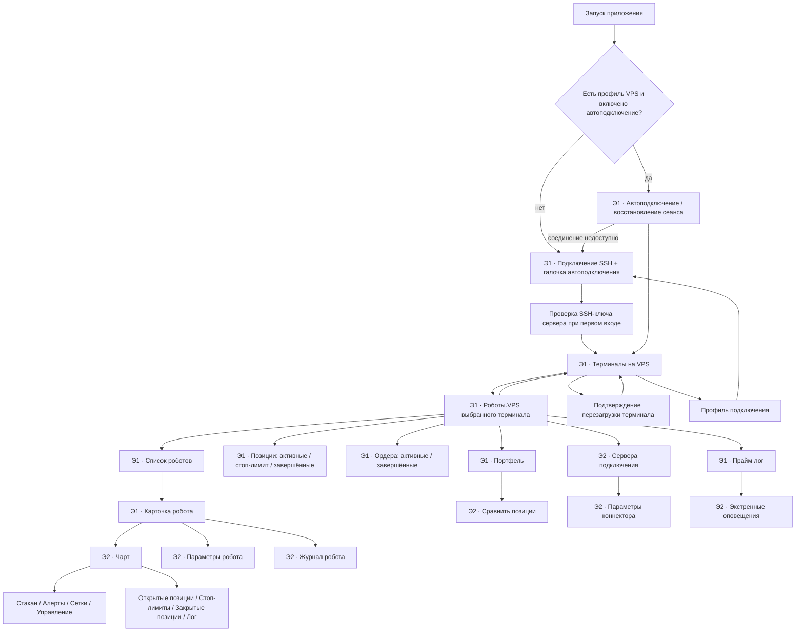

# Карта экранов OsEngine Mobile

Статус: проект экранов, 2026-09-28. `Э1` — необходимое ядро первого выпуска; `Э2` — следующие экраны по архитектуре существующей «Роботы.VPS». Стрелки обозначают переход пользователя; обновление данных происходит внутри экрана.

## 1. Подключение SSH

Поля: **SSH host**, **SSH user** (предложено `root`, редактируется), **SSH password** (скрытый ввод). Под ними — галочка **«Автоподключение по SSH при запуске»**, как в настольном клиенте, и кнопка «Подключиться». Настройка галочки сохраняется в профиле. При её включении после следующего запуска приложение само подключается к сохранённому VPS и открывает экран терминалов; при выключении всегда открывает экран SSH с заполненными host/user. После ошибки автоматического подключения открывается этот же экран с сообщением и возможностью повторить попытку. Автоподключение не выбирает терминал автоматически.

При первом соединении отдельное подтверждение отпечатка SSH-ключа сервера; при его изменении соединение останавливается. После успешного входа профиль сохраняет host/user и отпечаток, секреты — только в защищённом хранилище Android. В дальнейшем можно добавить вход по персональному SSH-ключу, как в настольном клиенте. В профиле доступно сменить VPS или отключиться.

## 2. Терминалы на VPS

Верхняя строка: SSH-состояние, адрес VPS, время последнего получения данных. Сводка **всего VPS**: CPU %, RAM %, диск `/` %. Это уже читается существующим `VpsMonitor` через SSH, в том числе когда терминал не отвечает.

Ниже — карточки `main`, `binance` и других обнаруженных сервисов. Каждая карточка показывает имя, состояние сервиса (работает / перезапускается / недоступен), CPU терминала %, RAM терминала в МБ и % от общей RAM VPS, время обновления. Показатель диска **общий для VPS**, поэтому он остаётся в сводке, а не повторяется в каждой карточке как будто это отдельный диск терминала. Здесь нет списка роботов или сведений о них. Нажатие на конкретный терминал открывает отдельный экран «Роботы.VPS» только этого экземпляра. Единственная команда в карточке терминала — **«Перезагрузка»**, с подтверждением, индикатором выполнения и проверкой возврата сервиса. Перезапуск относится к выбранному systemd-сервису, а не ко всему VPS.

Данные уже есть в `VpsInstances`/`VpsMonitor`: список сервисов, состояние, память процесса в байтах, накопленное CPU-время, общий CPU/RAM/диск VPS. Для процентов CPU требуется две выборки; до второй показывается `—`.

## 3. «Роботы.VPS» выбранного терминала

Этот экран открывается только после нажатия на терминал на предыдущем экране. Постоянная шапка: кнопка `← Терминалы`, крупное имя выбранного терминала (`main` или `binance`), состояние соединения с ним и время последнего обновления. Все вкладки и подробные окна остаются в контексте выбранного терминала. Это исключает путаницу при одинаковых именах роботов на разных экземплярах.

Основной экран повторяет разделы настольной `RobotsVpsLiteClone`: **Роботы, Позиции, Ордера, Портфель, Прайм лог, Сервера подключения**. На телефоне — нижняя навигация для первых четырёх разделов и «Ещё» для лога и серверов; на планшете — вкладки в исходном порядке и таблицы. Даже на планшете терминалы не показываются рядом с роботами: для смены терминала нужно вернуться к списку и выбрать другой. Источник каждого запроса — выбранный экземпляр MCP через SSH-туннель.

### Предлагаемая организация списка роботов

Первой видна краткая строка состояния: число роботов, число активных позиций, последнее обновление и фильтр/поиск по имени или бумаге. Затем список роботов. На телефоне каждая строка/карточка содержит **имя**, **тип**, **первую бумагу**, **позиций открыто/закрыто**, состояния **Вкл/выкл** и **Эмулятор**. На планшете это те же колонки таблицы `Robots.Lite / Robots.VPS`. Изменение переключателя отправляется выбранному терминалу и после ответа показывает фактическое состояние сервера; при недоступной связи состояние не угадывается.

Нажатие на робота открывает карточку с исходными действиями **Чарт, Параметры, Журнал** и подробным состоянием. Кнопки действий, которые будут перенесены позднее, должны наследовать названия и логику настольной вкладки. В первом выпуске главная цель — быстро увидеть состояние всех роботов, позиций, ордеров и портфеля; сложные торговые диалоги переносятся поэтапно с сохранением их структуры.

### Остальные разделы

| Раздел | Содержание | Источник архитектуры |
|---|---|---|
| Позиции | Активные, стоп-лимит, завершённые; уникальный номер позиции | `RobotsVpsLiteClone` |
| Ордера | Активные и завершённые, фильтр по роботу | `RobotsVpsLiteClone` |
| Портфель | Баланс, свободные/заблокированные средства, прибыль, инструменты; позже «Сравнить позиции» | `RobotsVpsLiteClone` |
| Прайм лог | События выбранного терминала, время, тип, сообщение | `RobotsVpsLiteClone` |
| Сервера подключения | Состояние биржевых коннекторов и их журналы; позже параметры | `RobotsVpsLiteClone` |
| Чарт робота | Сам график и вкладки Стакан, Алерты, Сетки, Управление; позиции и лог под ним | `RobotsVpsChartWindow` |
| Параметры робота | Группы/вкладки параметров, включая собственные вкладки стратегии | `RobotsVpsParametersUi` |

## Состояния и общие правила

- Пустой список терминалов, отсутствие роботов и ошибка загрузки данных — разные состояния с понятным текстом и повтором запроса.
- После потери сети показывать сохранённое последнее состояние с отметкой времени и меткой «Нет связи»; команды и переключатели не отправлять до восстановления соединения.
- Учитывать, что Android может останавливать приложение в фоне: при возвращении перепроверять SSH/MCP и заново загружать актуальное состояние. Для срочных оповещений отдельным этапом определить способ доставки, работающий без открытого приложения.
- Первое подключение защищать проверкой SSH host key. Пароль не записывать в журнал и не хранить открытым текстом. Доступ нескольких устройств — отдельные ключи и возможность отозвать конкретное устройство на VPS.
- Обновление мониторинга можно начать с существующего интервала около 10 с, списка роботов — около 5 с; при плохой связи уменьшать частоту. Для графика и стакана использовать их собственную периодичность, как в настольной «Роботы.VPS».

## Граница первого этапа

Схема фиксирует полную навигацию. Первый реализуемый срез: SSH-подключение с автоподключением по выбору пользователя → список терминалов и мониторинг → выбор терминала → «Роботы.VPS» только этого терминала со списком роботов и чтением позиций, ордеров, портфеля, лога. Остальные переходы остаются в карте и реализуются после согласования экранов и доступности данных.
